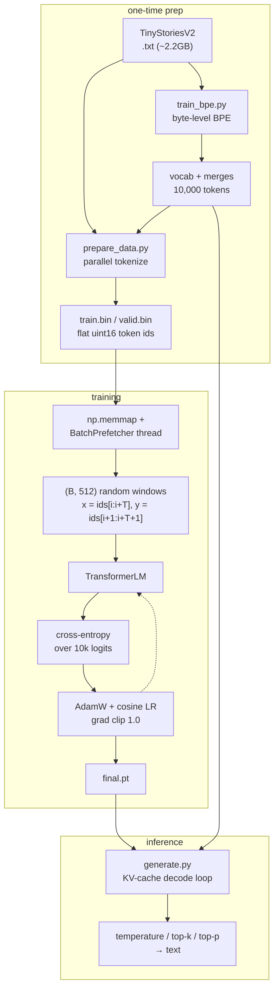
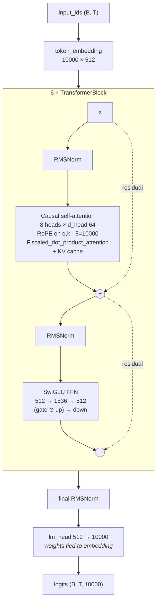

# tlm - a tiny large language model

A 25.57M-parameter decoder-only transformer, trained from scratch on TinyStories, with a custom byte-level BPE tokenizer. Everything is self-contained.



*Real output from `tlm-model/final.pt` — 153 tokens at 20.9 tok/s on an Apple M4 (MPS), temperature 0.8, top-k 50. The recording is the actual token stream, replayed at the speed it was produced.*

There's also a Streamlit UI over the same checkpoint:

```bash
uv run streamlit run app.py
```

## Repo layout

```
transformer/
├── pyproject.toml
├── app.py                             # Streamlit demo UI (streams tokens from tlm-model/final.pt)
├── demo.svg                           # the recording at the top of this README
├── tlm-model/                         # the trained artifact: checkpoint + the vocab it was trained with
│   ├── final.pt                       # step-20000 checkpoint (model + optimizer state, 307MB)
│   ├── tinystories_bpe_vocab.pkl
│   └── tinystories_bpe_merges.pkl
├── workspace/
│   ├── tinystories_bpe_vocab.pkl      # trained tokenizer vocab (10,000 tokens)
│   └── tinystories_bpe_merges.pkl     # trained tokenizer merge rules
├── data/                              # you populate this (see "Getting data onto the box")
├── tlm/                               # the package
│   ├── tokenizer.py                   # BPE tokenizer: encode/decode
│   ├── train_bpe.py                   # trains a BPE vocab from raw text (already done — vocab is in workspace/)
│   ├── pretokenization_example.py     # find_chunk_boundaries, used to split files for parallel processing
│   ├── generate.py                    # sampling logic: temperature / top-k / top-p, KV-cache decode loop
│   ├── model/
│   │   ├── config.py                  # TransformerConfig dataclass
│   │   ├── rmsnorm.py                 # RMSNorm
│   │   ├── rope.py                    # rotary position embeddings
│   │   ├── attention.py               # causal self-attention (flash/SDPA), KV-cache support
│   │   ├── feedforward.py             # SwiGLU MLP
│   │   ├── block.py                   # one pre-norm transformer block
│   │   └── transformer.py             # TransformerLM: embed -> N blocks -> final norm -> lm_head
│   └── train/
│       ├── data.py                    # memmap dataset, get_batch, BatchPrefetcher (background loading thread)
│       ├── optim.py                   # AdamW with decay/no-decay param groups, cosine LR schedule
│       ├── checkpoint.py              # save/load/resume
│       └── train.py                   # the training loop (entry point: `python -m tlm.train.train`)
└── scripts/
    ├── prepare_data.py                # tokenizes TinyStories .txt -> train.bin / valid.bin (parallelized)
    ├── train_bpe_tinystories.py       # (re)trains the BPE vocab from scratch, if you ever need to
    └── generate.py                    # CLI: load a checkpoint, generate text
```

## Architecture

The end-to-end pipeline — raw text in, sampled tokens out:



And the model itself — pre-norm, decoder-only, architecturally closer to Llama than to GPT-2:



Design choices, and why:

| Choice | Instead of | Why |
| --- | --- | --- |
| RMSNorm | LayerNorm | No mean subtraction, no bias — cheaper, and just as stable in practice |
| RoPE | learned / sinusoidal position embeddings | Relative positions baked into attention; no position parameters to train |
| SwiGLU | ReLU/GELU MLP | Better loss per parameter at the same FLOPs budget |
| Pre-norm | post-norm | Clean residual path; trains without a warmup babysitting act |
| Tied embeddings | separate lm_head | Saves 5.12M params (20% of the model) on a 10k vocab |
| No biases anywhere | biases on linears | Free parameter savings, no measurable quality cost |
| SDPA | hand-rolled attention matmul | Dispatches to fused flash-attention on CUDA |

## Key numbers

**Model** — `d_model=512, n_layers=6, n_heads=8, d_ff=1536, context_length=512, vocab_size=10000`:

| | |
| --- | --- |
| Total parameters | **25.57M** |
| Non-embedding parameters | 20.45M |
| Token embedding (tied with `lm_head`) | 5.12M |
| Attention, all 6 blocks | 6.29M |
| SwiGLU FFNs, all 6 blocks | 14.16M |
| Norm scales (13 RMSNorms) | 0.007M |
| Head dim | 64 |
| Checkpoint on disk (`final.pt`, fp32 weights + AdamW state) | 307MB |

**Training loss.** Plain next-token **cross-entropy**, averaged over every position in the batch — `F.cross_entropy(logits.view(-1, 10000), targets.view(-1))` in [transformer.py:58](tlm/model/transformer.py#L58). Targets are the inputs shifted by one, so a `(B, 512)` batch contributes `B × 512` prediction sites. The number is a mean negative log-likelihood in nats; `exp(loss)` is the perplexity that `estimate_loss` reports alongside it every `--eval-interval` steps ([train.py:149](tlm/train/train.py#L149)). Validation uses the same loss on `valid.bin`, averaged over `--eval-iters` (default 50) random batches.

Where `tlm-model/final.pt` landed after 20,000 steps:

| | loss (nats/token) | perplexity | bits/token |
| --- | --- | --- | --- |
| Train | **1.14** | 3.13 | 1.64 |
| Validation | **1.18** | 3.25 | 1.70 |

A 0.04-nat train/val gap on ~655M tokens seen means essentially no overfitting — unsurprising with dropout at 0 and roughly one pass over the data. In practical terms the model is choosing between about 3 plausible next tokens at each step, which is what a 25M-param model on a deliberately simple, small-vocabulary story corpus should look like: fluent and grammatical within TinyStories' register, and no further than that.

**Training recipe** (the defaults in [train.py](tlm/train/train.py), which is what `tlm-model/final.pt` was produced with):

| | |
| --- | --- |
| Steps | 20,000 (the checkpoint's recorded step) |
| Batch | 64 sequences × 512 tokens = 32,768 tokens/step |
| Tokens seen | 20,000 × 32,768 ≈ **655M** (order of one pass over TinyStoriesV2) |
| Optimizer | AdamW, β=(0.9, 0.95), ε=1e-8, fused on CUDA |
| Weight decay | 0.1 — applied to the 31 matmul/embedding tensors, **not** to the 13 RMSNorm scales |
| LR schedule | linear warmup 500 steps → 3e-4, cosine decay → 3e-5 |
| Grad clipping | max norm 1.0 |
| Precision | bf16 autocast on CUDA (fp16 + GradScaler fallback), fp32 on MPS/CPU |
| Compile | `torch.compile` on automatically when CUDA is present |
| Init | N(0, 0.02); residual projections scaled by 1/√(2·n_layers) |
| Final loss | 1.14 train / 1.18 val |

**Inference.** Decoding is O(1) per token, not O(n): the prompt goes through in one forward pass, then each subsequent step feeds a single token and reuses the stored keys/values ([generate.py:23-35](tlm/generate.py#L23-L35)). Measured **20.9 tok/s** for the run at the top of this README (153 tokens in 7.3s, Apple M4 / MPS, fp32, no compile). A CUDA box with bf16 and a compiled model is an order of magnitude faster; this is the slow path and it's still comfortably real-time for a demo.

**Tokenizer.** Byte-level BPE, GPT-2 style, 10,000 tokens trained on TinyStories itself — small enough that the tied embedding table stays a fifth of the model, and domain-matched enough that common story words ("Once upon a time", names, "The end") are one or two tokens. `<|endoftext|>` is a special token, used both as a document separator during data prep and as the stop condition during generation.
